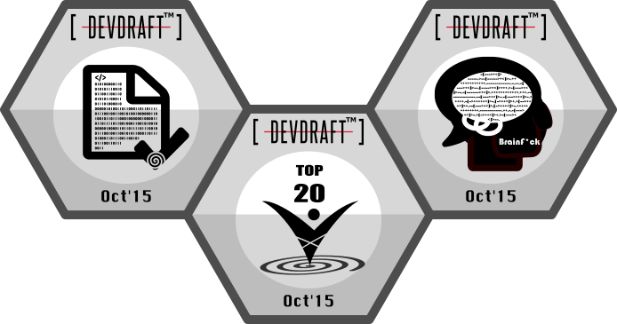

> WANDERING BETWEEN SIN AND DISCIPLINE,
> WHAT I CAN DO IS MERELY TO LOOK AROUND AND LINGER ON IN VANITY FAIR.
>
>　　　　　　　　　　　　　　　　　　　　　　　 --- FOREVER AND EVER

**Farley Lai** is a researcher in the Machine Learning department at the NEC Laboratories America.
His current research focuses on video understanding and reasoning in retail.
Previous research projects involves defect detection for manufacturing, visual entailment tasks for multi-modal reasoning between images and text 
as well as state of the art language grounding.
He received his Ph.D. under the supervision of Prof. Octav Chipara in Computer Science at the University of Iowa.
High performance stream processing to model the runtime behavior and improve resource efficiency of stream applications through compile-time analysis serves as his research foundation.
His M.S. was completed with thesis on distributed mutual exclusion and scheduling fairness at the National Central University in Taiwan.
Before pursuing a Ph.D., he had been working in the surveillance industry and led a project of developing video management software.
He is reachable via [social networks](http://www.linkedin.com/in/farleylai).

## Honors and Awards

[//]: # (An up-to-date link:/files/resume-farleylai.pdf[resume] is available for reference.)

- 2020 NEC Labs Business Contribution Award for Smart Video Surveillance in the Retail Industry
- $500 for SIGBED ESWEEK 2015 Student Travel Grant
- DevDraft Top 20 finalists 2015 with perfect code correctness and advanced CS achievements
- DevDraft Top 10 finalists 2014
- NSF-funded student travel support to CPSWeek 2014 in the amount of $1500
- Best Student Paper Award at CBMS 2013
- Full tuition scholarship in Computer Science at the University of Iowa

