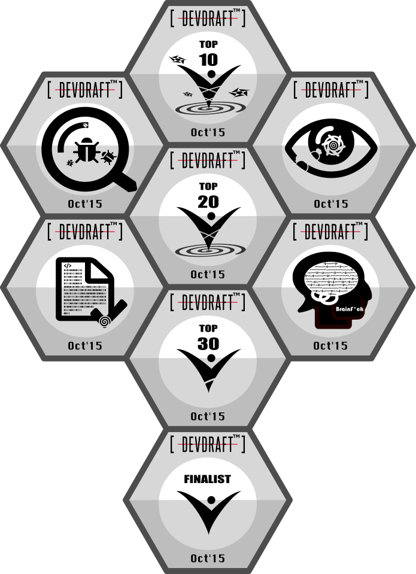

## 2015 DevDraft Badge Design

At the request of DevDraft, I designed the following achievement badges for the finals Oct'15 over the weekend.
It was fun and creative. Sometimes it could be more challenging than solving algorithmic puzzles.
However, this context switch is healthy and demonstrates my artistic sense is still functional.

- Top10
- Top20
- Top30
- Finalist
- Code Correctness
- Attention to Details
- Debugging
- Advanced CS

## 2002 Baloo Camp Logo and T-Shirt Design

I was a rover scout through my college at the National Tsing Hua University in Taiwan.
Senior scout crew traditionally held the Baloo camp before graduation to pass down knowledge and skills.
I designed the camp logo and T-shirt in appreciation of the bonding experience in our generation.

