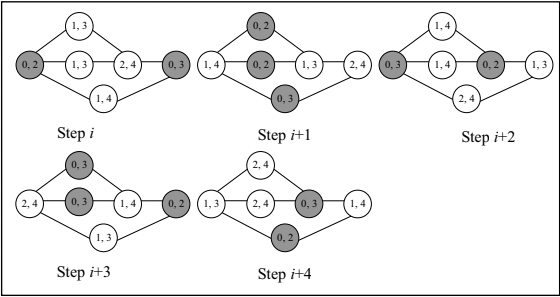

Up to date publications and patents issued or not can be found on [Google Scholar](https://bit.ly/3taq2VT).
The portfolio is intended to demonstrate the highlights in selected research and development projects.

## AI/ML

## Distributed Computing

{:.image-left }
Optimal Alternators with Reduced Space Complexity  
**Farley Lai**, Shing-Tsaan Huang  
[[paper]](https://bit.ly/3ta4LM2)

[//]: # (## Blockchain)
