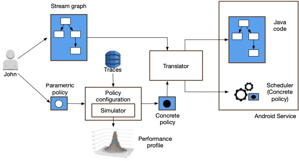

Up to date publications and patents issued or not can be found on [Google Scholar](https://bit.ly/3taq2VT).
The portfolio is intended to demonstrate the highlights in selected research and development projects.

[//]: # (## Blockchain)

## AI/ML

{:.image-left }
COMPOSER: Compositional Learning of Group Activity in Videos  
Honglu Zhou, Asim Kadav, Aviv Shamsian, Shijie Geng, **Farley Lai**,  
Long Zhao, Ting Liu, Mubbasir Kapadia, Hans Peter Graf   
[[Under Review]](https://bit.ly/3NcHKzU), 2022  

{:.image-left }
Self-supervised Video Representation Learning with Cascade Positive Retrieval  
L3D-IVU at CVPR, 2022  
[[paper]](https://bit.ly/3GK55X3) [[code]](https://bit.ly/3x9X2zT)  
 

{:.image-left }
Hopper: Multi-hop Transformer for Spatiotemporal Reasoning  
ICLR, 2021  
[[paper]](https://bit.ly/3aCSOrJ) [[code]](https://github.com/necla-ml/cater-h)  
 

{:.image-left }
<u>15 Keypoints Is All You Need</u>  
Michael Snower, Asim Kadav, **Farley Lai**, Hans Peter Graf  
CVPR, 2020  
[[paper]](https://bit.ly/3zehNvM)  

{:.image-left }
<u>Contextual Grounding of Natural Language Phrases in Images</u>  
**Farley Lai**, Ning Xie, Derek Doran, Asim Kadav  
ViGIL at NeurIPS, 2019  
[[paper]](https://bit.ly/3NaDfG8) [[code]](https://bit.ly/3NUqijL)  
 

{:.image-left }
<u>Visual Entailment: A Novel Task for Fine-grained Image Understanding</u>  
Ning Xie, **Farley Lai**, Derek Doran, Asim Kadav  
ViGIL at NeurIPS, 2018  
[[paper]](https://bit.ly/3M8KxZp) [[code]](https://bit.ly/3x6FJOG)  

## Mobile Sensing

{:.image-left }
<u style='font-size: 14px'>Workload Shaping Energy Optimizations with Predictable Performance for Mobile Sensing</u>  
**Farley Lai**, Marjan Radi, Octav Chipara, William G. Griswold  
IoTDI, 2018  
[[paper]](https://bit.ly/3aCODft)  
 
 

{:.image-left }
<u>Stream Processing Optimizations for Mobile Sensing Applications</u>  
**Farley Lai**, Octav Chipara  
Ph.D. Dissertation in CS, University of Iowa, 2017  
[[paper]](https://bit.ly/3tauR1h)  

{:.image-left }
<u>Static Memory Management for Efficient Mobile Sensing Applications</u>  
**Farley Lai**, Daniel Schmidt, Octav Chipara  
EMSOFT, 2015  
[[paper]](https://bit.ly/3m8PuHo)  

{:.image-left }
<u>CSense: A Stream-Processing Toolkit for High-Rate Mobile Sensing Applications</u>  
**Farley Lai**, Syed Shabih Hasan, Austin Laugesen, Octav Chipara  
IPSN, 2014  
[[paper]](https://bit.ly/3x5WoTY)  

{:.image-left }
<u>AudioSense: Enabling Real-time Evaluation of Hearing Aid Technology In-Situ</u>  
Syed Shabih Hasan, **Farley Lai**, Octav Chipara, Yi-Hsien Wu  
Best Student Paper Award, CBMS, 2013  
[[paper]](https://bit.ly/3Nbw7JD)  

## Distributed Computing

{:.image-left }
<u>Optimal Alternators with Reduced Space Complexity</u>  
**Farley Lai**, Shing-Tsaan Huang  
Master Thesis in CS, National Central University, Taiwan, 2002  
[[paper]](https://bit.ly/3ta4LM2)  
